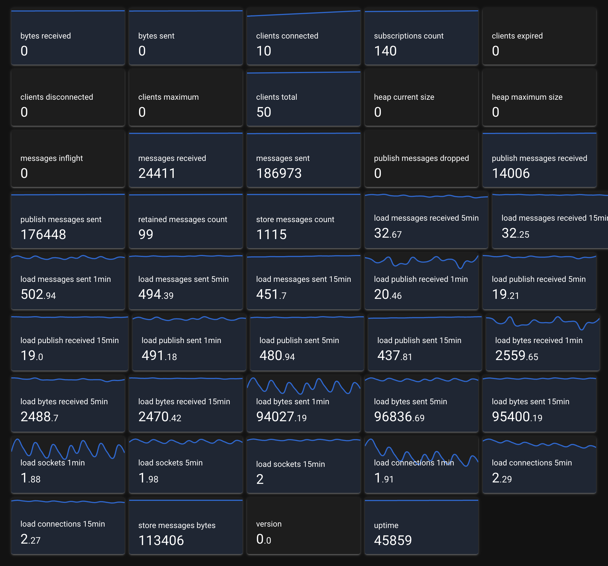

# mqttMyAdmin
We're building mqttMyAdmin, the most used MQTT management tool.

This project is a simple web-based MQTT client built with VueJS, Quasar, using the MQTT.js library. It allows you to connect to an MQTT broker using URL parameters to specify the broker’s hostname, port, and optional login credentials. This makes it easy to configure the client without modifying the code.

## Key Features

- **Quasar Framework**: Used Quasar Framework 2.6 UMD version, with CSS animated values and Plotly JS as chart
- **URL-Based Configuration**: Configure the MQTT connection using URL parameters, allowing dynamic specification of the broker, port, username, and password.
- **Real-Time Message Handling**: Logs messages received from subscribed topics directly in the browser console.

### URL Parameters

- `broker` (required): The hostname or IP address of the MQTT broker.
- `port` (optional): The WebSocket port for connecting to the MQTT broker. Defaults to `8000`.
- `username` (optional): Username for MQTT brokers that require authentication.
- `password` (optional): Password for MQTT brokers that require authentication.

### Example Usage

Use the following URL format to specify connection details for the MQTT client:

[https://tjunussov.github.io/mqttMyAdmin/?broker=broker.hivemq.com&port=8000&username=user&password=pass](https://tjunussov.github.io/mqttMyAdmin/?broker=broker.hivemq.com&port=8000&username=user&password=pass)

### ToDo
- persist settings
- persist historcal data
- red flags alers
- grouping metrics
- sound fx
- polish ui like hivemq
- attach custom domain
- 
